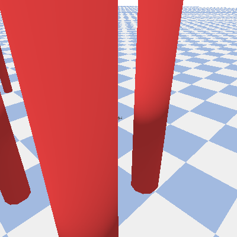
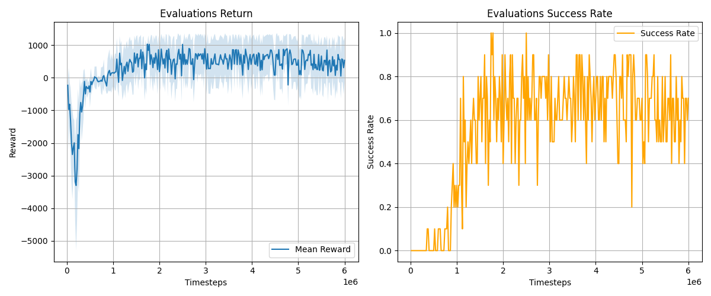

# Demo Navigation - 无人机导航与避障训练

## 效果演示（6000000 steps）





## 任务
基于 `gym-pybullet-drones` 的强化学习演示，使用 PPO 算法训练单无人机完成点到点导航任务：
- 从**随机起点**出发
- **自主避障**：安全绕过多个圆形障碍物
- 到达**随机终点**

---

## 快速开始

### 1. 环境要求
- Python 3.10
- CPU

### 2. 安装步骤

**第一步：克隆仓库**
```bash
git clone https://github.com/utiasDSL/gym-pybullet-drones.git
cd gym-pybullet-drones
```

**第二步：创建虚拟环境（推荐）**
```bash
# 使用 conda
conda create -n drones python=3.10
conda activate drones

# 或使用 venv
python -m venv venv
source venv/bin/activate  # Linux/Mac
```

**第三步：安装依赖**
```bash
# 安装 gym-pybullet-drones(包含强化学习库)
pip install -e .
```

### 3. 运行训练
在当前目录克隆demo_navigation
进入 demo_navigation 目录：
```bash
cd ./demo_navigation
```

**基础训练（600万步，4个并行环境）**
```bash
python train_demo.py
```

**自定义参数训练**
```bash
# 训练 500 万步，使用 2 个并行环境
python train_demo.py --timesteps 5000000 --n-envs 2

# 启用 GUI 查看训练过程（很慢，不推荐）
python train_demo.py --timesteps 1000000 --gui

# 使用所有默认参数但改总步数
python train_demo.py --timesteps 10000000
```

---

## 参数说明

| 参数 | 类型 | 默认值 | 说明 |
|------|------|--------|------|
| `--timesteps` | int | 6,000,000 | 总训练步数 |
| `--n-envs` | int | 4 | 并行环境数（越多数据收集越快，但需要更多内存） |
| `--gui` | flag | False | 是否显示 PyBullet GUI（调试用，会大幅减速） |
| `--record_video` | flag | False | 是否录制视频（当前代码未启用） |

---

## 输出结果

训练完成后，在 `demo_results/` 目录下生成：

```
demo_results/
├── best_model.zip              # 最优模型权重
├── final_model.zip             # 最后一次训练的模型
├── evaluations.npz             # 评估数据（10个episode的奖励、成功率）
├── monitor.csv                 # 环境监测日志（每个episode的元数据）
├── training_curves.png         # 训练曲线图（奖励 + 成功率）
└── train_step_*.gif            # [可选] 定期保存的训练过程 GIF（需启用回调）
```

### 训练曲线说明

`training_curves.png` 包含两个子图：
1. **左图 - Evaluations Return**：每 5000 步评估一次，显示 10 个 episode 的平均奖励
2. **右图 - Evaluations Success Rate**：成功率曲线（到达目标的成功比例）

期望：曲线向上趋势表示模型在学习

---

### NavigateAviary 环境配置

- `generate_obstacles_grid()`：按网格生成圆形障碍，带 `min_clearance` 防重叠。
- `sample_free_goal()`：随机采样终点，要求与障碍中心距离大于 `r + 1.5`。
- `sample_free_start(self)`:随机起点
---

### 启用 GIF 录制（可选）

训练过程中每 xxx 步自动保存模型行为的 GIF（会增加训练时间）：

编辑 `train_demo.py`，取消注释 `GifRecordingCallback` 类和相关代码：
```python
# class GifRecordingCallback(BaseCallback):
#     ...
```

改为：
```python
class GifRecordingCallback(BaseCallback):
    ...
```

然后修改 `run()` 函数中的回调组合：
```python
# 注释掉这行
# callback=eval_callback)

# 取消注释这行
combined_callback = CallbackList([eval_callback, gif_callback])
model.learn(..., callback=combined_callback)
```

---

**Q: 如何使用训练好的模型进行推理？**  
A: 
```python
from stable_baselines3 import PPO
model = PPO.load("demo_results/best_model")
env = NavigateAviary(gui=True)  # 启用 GUI 查看
obs, _ = env.reset()
for _ in range(1000):
    action, _ = model.predict(obs, deterministic=True)
    obs, reward, done, truncated, _ = env.step(action)
    if done or truncated:
        break
env.close()
```

---

## 环境与算法说明

### 观察空间
- 无人机位置、速度、加速度（9维）
- 每个障碍物距离（通过距离函数计算）
- 目标点位置

### 动作空间
- 9 个离散动作（8 个方向 + 停止）
- 对应速度控制：$v_x \in [-1.5, 1.5]$ m/s，$v_y \in [-1.5, 1.5]$ m/s

### 奖励函数
```python
奖励 = 
  - 距离终点的奖励（近距离更高）
  - 碰撞障碍物的惩罚
  - 到达目标的奖励（+1000）
  - 时间步惩罚（鼓励快速完成）
```

### PPO 超参数
- `n_steps`：2048（每次 rollout 的步数）
- `batch_size`：128（mini-batch 大小）
- `device`：CPU（如果有 GPU，改为 "cuda"）

---
